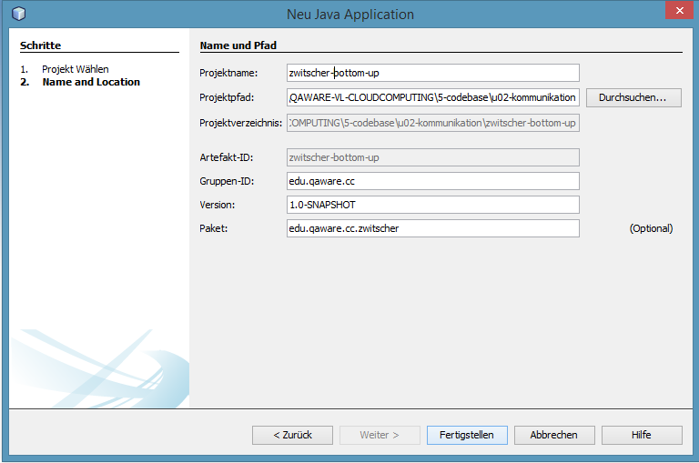

# Übung: Das REST Protokoll

## Vorbereitung
1. Starten Sie Netbeans (die Startdateien befinden sich im bin Ordner).
2. Erstellen Sie innerhalb von Netbeans ein neues Projekt (`Datei -> Neues Projekt`). Wählen Sie dabei eine `Maven / Java Application` als Projektart aus.
3. Definieren Sie die Projekteigenschaften wie in der folgenden Abbildung dargestellt:

4. Öffnen Sie die Datei `pom.xml` (Maven Projektbeschreibung) und fügen Sie dort ein zunächst noch leeres Element `dependencies` ein. Ergänzen Sie innerhalb dieses Elements die folgenden Bibliotheksabhängigkeiten in einer jeweils aktuellen Version. Bitte die hier angegebene Reihenfolge beachten. Die entsprechenden XML-Fragmente für Maven können sie über http://mvnrepository.com beziehen.
   1. `dropwizard-core`
   * `dropwizard-assets`
   * `swagger-jaxrs_2.10`
5. Führen Sie das Maven Goal `clean package` aus.

## Ziel
Wir erstellen und dokumentieren eine REST-API, mit dem auf eine Nachricht mit beliebigem Inhalt zugegriffen werden kann.

## Aufgaben
### Aufgabe 1: REST-API mit Dropwizard erstellen
Bei dieser Aufgabe geht es darum, eine einfache REST-Schnittstelle aufzubauen und auf Basis von Dropwizard ausführbar zu machen. Dazu gehen Sie bitte wie folgt vor:
#### Schritt 1: REST-Schnittstelle auf Basis JAX-RS aufbauen
1. Erstellen Sie unterhalb des Applikationspakets (`edu.qaware.cc.zwitscher`) die Unterpakete `api` und `core`. In `api` wird sich die eigentliche REST-Schnittstelle befinden und in `core` die Anbindung an Dropwizard.
* Erstellen Sie unterhalb des `api` Pakets noch zwei weitere Pakete: `resources` für die eigentliche REST-Schnittstelle und `entities` für die an der REST-Schnittstelle genutzten Entitäten.
* Erstellen Sie im Paket `api.resources` eine Klasse `ZwitscherMessageResource` und im Paket `api.entities` eine Klasse `ZwitscherMessage`.
*  Programmieren Sie das Grundgerüst für die beiden Klassen.
  * Die Klasse `ZwitscherMessage` besitzt die Felder `timestamp` (Typ: `Date`) und `message` (Typ: `String`) sowie die entsprechenden Getter- und Setter-Methoden.
  * Die Klasse `ZwitscherMessageResource` besitzt eine Methode: `ZwitscherMessage getRandomMessage()``
* Implementieren Sie die Methode `getRandomMessage()` so, dass sie eine Nachricht mit beliebigem Inhalt und aktuellem `timestamp` zurückliefert.
* Ergänzen Sie die Klassen so, dass sie durch JAX-RS als REST-Schnittstelle angeboten werden können. Die Methode `getRandomMessage()` soll dabei wie folgt aufgerufen werden können GET `{basis-url}/messages/random` und ein JSON-Objekt zurückliefern.

#### Schritt 2: Die REST-Schnittstelle in Dropwizard integrieren und ausführen
1. Erstellen sie die Klasse `ZwitscherConfiguration` im Paket `core`. Diese Klasse dient Dropwizard dazu, Konfigurationsparameter in einer Konfigurationsdatei zugänglich zu machen. Die Klasse muss dazu von `Configuration` erben. Damit werden auf jeden Fall alle Dropwizard Konfigurationsparameter verfügbar gemacht. Da wir keine applikationsspezifischen Konfigurationsparameter verwenden, können wir die Klasse leer lassen.
* Erstellen sie die Klasse `ZwitscherApplication` im Paket `core`. Dies ist die Startklasse für unseren Service. Sie erbt von `Application<ZwitscherConfiguration>`. Ergänzen Sie dafür eine `main()`-Methode, die die Applikation startet wie folgt:
```java
new ZwitscherApplication().run(
        new String[]{"server",
                     "./src/main/resources/zwitscher-config.yml"});
```
Der hier übergebene Parameter `server` bedeutet, dass ein REST-Server hochgefahren werden soll. Der zweite Parameter verweist auf die Konfigurationsdatei mit allen notwendigen Konfigurationsparametern.
* Erstellen Sie die entsprechende Konfigurationsdatei und fügen Sie die folgenden Konfigurationsparameter ein:
```yaml
server:
  applicationConnectors:
    - type: http
      port: 2890
  adminConnectors:
    - type: http
      port: 2891      
logging:
  level: INFO
```
* Überschreiben Sie die beiden Methoden `initialize()` und `run()` aus der Basisklasse `Application`. Hinweis: Netbeans unterstützt dabei per Alt + Return. Die Methode `initialize()` kann leer bleiben. In der Methode `run()` muss noch die REST-Ressource registriert werden:
```java
e.jersey().register(ZwitscherMessageResource.class);
```
* Starten Sie im Anschluss die Applikation in Netbeans und rufen Sie die REST-Schnittstelle im Browser auf (URL: http://localhost:2890/messages/random).   

### Aufgabe 2: API mit Swagger dokumentieren
#### Schritt 1: API dokumentieren

(1) Dokumentieren sie die vorhandenen Klassen der REST-API über Swagger-Annotationen zusätzlich zu den bereits vorhandenen JAX-RS-Annotationen. Nutzen Sie hierfür die folgenden Swagger-Annotationen. Eine Beschreibung der Annotationen ist hier zugänglich: https://github.com/swagger-api/swagger-core/wiki/Annotations-1.5.X.

| Swagger-Annotation        | Code-Element           |
| ------------- | ------------- |
| `@Api`      |Ressourcen-Klasse (REST-Schnittstelle) |
| `@ApiOperation`      | Methode der Ressourcen-Klasse      |
| `@ApiResponses` und `@ApiResponse` | Methode der Ressourcen-Klasse (überlegen Sie sich hier mögliche Fehlersituationen und bilden Sie diese auf http-Status-Codes ab)      |
| `@ApiModel` | Entitäts-Klasse      |
| `@ApiModelProperty` | Setter-Methoden der Entitätsklasse      |

(2) Integrieren Sie Swagger in Dropwizard. Swagger erzeugt damit automatisch eine API-Beschreibung aus den JAX-RS- und Swagger-Annotationen sowie den Klassen- und Methodenstrukturen. Damit dies erfolgt, müssen Sie den folgenden Code-Abschnitt in der `run()`-Methode der Applikationsklasse ergänzen:

```java
//Swagger REST-Schnittstelle registrieren       
e.jersey().register(new ApiListingResourceJSON());     
e.jersey().register(new ApiDeclarationProvider());
e.jersey().register(new ResourceListingProvider());

//Swagger konfigurieren
ScannerFactory.setScanner(new DefaultJaxrsScanner());
ClassReaders.setReader(new DefaultJaxrsApiReader());

SwaggerConfig config = ConfigFactory.config();
config.setApiVersion("1.0.0");
config.setBasePath("..");
```

(3) Starten Sie die Anwendung nun neu. Die API-Beschreibung durch Swagger ist nun unter der URL http://localhost:2890/api-docs/ zugänglich. Alle verfügbaren REST-Endpunkte können Sie auch der Log-Ausgabe von Dropwizard entnehmen.   
Analysieren Sie die JSON-Struktur der Swagger-Schnittstellenbeschreibung. Beachten Sie dabei, dass http://localhost:2890/api-docs lediglich der Einstieg in die Beschreibung ist. Die Beschreibung der bisher entwickelten Ressource ist unter http://localhost:2890/api-docs/messages/random zu finden.
Hinweis: Die JSON-Struktur wird einfacher lesbar, wenn Sie innerhalb von Netbeans eine JSON-Datei anlegen, die Inhalte aus dem Browser dorthin kopieren und den JSON-Code layouten (Alt + Umschalt + F im Editor).


#### Schritt 2: Schnittstelle über Swagger UI zugänglich machen
* Laden Sie sich den Quellcode der Swagger UI von github herunter (https://github.com/wordnik/swagger-ui, „Download ZIP“).
* Kopieren Sie die Inhalte aus dem `dist`-Verzeichnis in das Verzeichnis `src/main/resources/assets/swagger-ui` im Entwicklungsprojekt.
* Ergänzen Sie in der `initialize()` Methode der Applikationsklasse den folgenden Code, der die Dateien der Swagger-UI per URL http://localhost:2890/api-browser/ verfügbar macht:
```java
bootstrap.addBundle(new AssetsBundle("/assets/swagger-ui", "/api-browser", "index.html"));
```
* Starten Sie die Anwendung neu und rufen Sie die Swagger UI im Browser auf. Ersetzen Sie die dort angegebene URL der Schnittstellenbeschreibung durch die entsprechende URL des Swagger-REST-Schnittstelle im Projekt. Erkunden Sie im Anschluss die Möglichkeiten der Swagger UI.

### Kür: REST-API weiter ausbauen
Bauen Sie die REST-Schnittstelle weiter aus. Gehen Sie dabei so vor, wie im Vortrag vorgestellt:
* Überlegen Sie sich die Anwendungsfälle, die die Schnittstelle abbilden soll als einfache Liste (auf Papier). Hinweis: Authentifizierung und Autorisierung brauchen Sie nicht zu berücksichtigen.
* Leiten Sie aus den Anwendungsfällen ein Datenmodell ab (auf Papier).
* Erstellen Sie aus den Anwendungsfällen, dem Datenmodell und den vorgestellten Entwurfsregeln eine REST-Schnittstelle. Zunächst genügt dabei eine Liste an URL-Signaturen als Kommentar in einer Textdatei.
* Erweitern Sie die vorhandene REST-Schnittstelle entsprechend. Implementieren Sie die Methoden dabei so, dass sie Testdaten zurückgeben. Fügen Sie JAX-RS- und Swagger-Annotationen hinzu.
* Starten Sie die REST-Schnittstelle und überprüfen Sie mit der Swagger UI, ob sie soweit funktioniert.

## Quellen
Diese Übung soll auch eine eigenständige Problemlösung auf Basis von Informationen aus dem Internet vermitteln. Sie können dazu für die eingesetzten Technologien z.B. die folgenden Quellen nutzen:

Netbeans
* http://netbeanside61.blogspot.de/2008/04/top-10-netbeans-ide-keyboard-shortcuts.html

Maven
* http://maven.apache.org/guides/getting-started

JAX-RS
* https://github.com/wordnik/swagger-core/wiki/Java-JAXRS-Quickstart
* https://jersey.java.net/documentation/latest/jaxrs-resources.html

Dropwizard
* http://dropwizard.io/manual/core.html
* http://kielczewski.eu/2013/04/developing-restful-web-services-using-dropwizard  

Swagger
* http://swagger.io
* https://github.com/wordnik/swagger-core/tree/master/modules/swagger-annotations/src/main/java/com/wordnik/swagger/annotations
* http://java.dzone.com/articles/swagger-make-developers-love

Beispiele für REST APIs
* https://dev.twitter.com/rest/tools/console
* http://www.programmableweb.com/apis/directory
