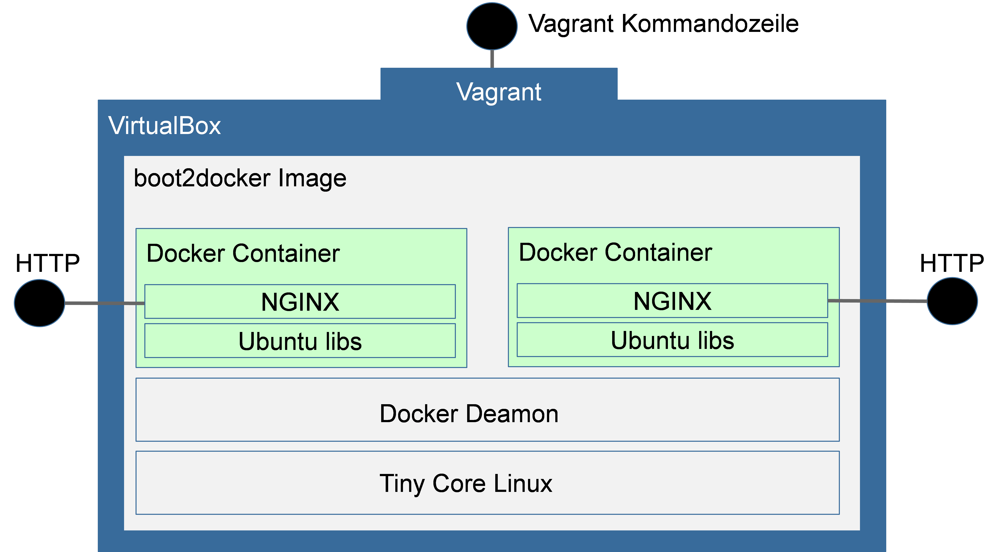

# Übung: Virtualisierung mit Vagrant und Docker

## Ziel

## Vorbereitung
1. Prüfen sie, ob VirtualBox und Vagrant installiert sind. Installieren Sie beides für den Fall, dass sich auf ihrem Notebook die Software nicht befindet. Schauen sie sich mit dem Kommando `vagrant help` alle verfügbaren Kommandos von Vagrant an.
* Erstellen sie ein Verzeichnis für die Übung (auf ihrem Home-Laufwerk oder lokal auf dem Rechner) und laden sie die Vorlage zur Übung von github herunter (die ZIP-Datei). Entpacken sie die ZIP-Datei und starten sie die Konsole mit `console.bat`.
* Initialisieren sie mit Vagrant eine Box auf Basis der Vorlage *hashicorp/boot2docker* (`vagrant init`)
* Starten sie die Vagrant Box (`vagrant up`). Im Hintergrund lädt Vagrant dabei das virtuelle Image aus dem Internet.
* Überprüfen sie den Status der Vagrant Boxen (`vagrant status`), fahren sie die Box herunter (`vagrant halt`) und überprüfen sie abermals den Status.

*Hinweis:* Sollte Vargant nicht funktionieren oder der Download der Virtuellen Maschine zu lange dauern, dann können Sie die folgende Übung ab Schritt 3 auch hier durchführen: https://www.katacoda.com/courses/docker/playground

## Aufgaben
1. Starten sie die vorbereitend erzeugte Vagrant Box und überprüfen sie die Log-Ausgaben dabei.
* Verbinden sie sich per `vagrant ssh` per Kommandozeile in die Vagrant Box. Das Passwort dafür ist *tcuser*.
* Starten sie einen Docker Container auf Basis des *alpine* Images und lassen sie darin eine interaktive Konsole als Entrypoint-Prozess laufen.
* Initialisieren sie die Paketmanager *apk* mit `apk update`
* Installieren sie den NGINX Webserver mit `apk add nginx` und analog das curl Paket.
* Starten sie den NGINX Webserver mit dem Befehl `nginx`. Hinweis: Sollte dabei der Fehler _open() "/run/nginx/nginx.pid" failed_ auftreten, dann bitte das entsprechende Verzeichnis erstellen mit `mkdir /run/nginx`. 
* Lassen sie sich mit dem `curl` Befehl die Website auf der Kommandozeile ausgeben, die der NGINX Webserver auf *localhost* Port 80 zur Verfügung stellt. Überprüfen sie, ob eine Begrüßungs-Website von NGINX ausgegeben wird.
* Steigen sie aus der Bash im Docker Container per `exit` Befehl aus. Wo befinden sie sich nun?
* Lassen sie sich alle von Docker verwalteten Container anzeigen mit `docker ps –a` und ermitteln sie die Container-Id des gerade erzeugten Containers. Warum sehen sie den Container nicht mit `docker ps`?
* Erstellen sie ein Image aus dem erzeugten Container mit dem Befehl `docker commit <CONTAINER ID> cloudcomputing/nginx`
* Lassen sie sich mit `docker images` alle von Docker verwalteten Images anzeigen und prüfen sie, ob das soeben erzeugte Image mit dabei ist.
* Steigen sie per `exit` aus der Vagrant Box aus hin zur anfänglichen Kommandozeile.
* Öffnen sie das Vagrantfile mit einem Texteditor uns suchen sie darin das Beispiel für ein Port Forwarding. Leiten sie die Ports 80 und 81 aus dem Gast-System auf die Ports 8080 bzw. 8081 des Host-Systems weiter.
* Laden sie die Vagrant Box per `vagrant reload` neu. Dabei wird die Konfiguration neu eingespielt. Verbinden sie sich per Kommandozeile in die Vagrant Box.
* Starten sie einen NGINX Container im Daemon-Modus und leiten sie dabei den Gast-Port 80 auf den Host-Port 80 weiter. Der Entrypoint-Prozess ist dabei NGINX. NGINX muss dabei aber im Vordergrund, also im Nicht-Daemon-Modus, laufen: `nginx -g 'daemon off;'`
* Starten sie gleich im Anschluss einen zweiten NGINX Container und verbinden sie dessen Port 80 auf den Host-Port 81.
* Lassen sie sich alle laufenden Docker Container per `docker ps` anzeigen. Lassen sie sich per `curl` die Ausgaben auf *localhost* unter den Ports 80 und 81 ausgeben.
* Sie können nun auch auf die NGINX-Seiten direkt aus einem Browser des Haupt-Betriebssystems ihres Rechners zugreifen. Über welche URL ist dies möglich?
* Inspizieren sie die Docker Container mit `docker inspect` und lassen sie sich die Systemlogs in den Containern per `docker logs` ausgeben.
* Fahren sie innerhalb der Vagrant Box zunächst per `docker stop` die beiden Docker Container herunter und beenden sie anschließend die Vagrant Box über `vagrant halt`.

## Fundierter Einstieg in Docker
Für die Vorlesung wird empfohlen einen tieferen Einstieg in Docker zu machen, als dies im Rahmen der Übung möglich ist. Nutzen sie hierfür den dreien Docker-Kurs auf Katacoda: https://katacoda.com/courses/docker. Arbeiten Sie die folgenden Szenarien im Sinne einer Hausaufgabe durch:
 * Launching Containers
 * Deploy Static HTML Websites as Container
 * Building Container Images
 * Dockerizing Node.js
 * Optimise Builds With Docker OnBuild
 * Ignoring Files During Build
 * Create Data Containers
 * Creating Networs Between Containers Using Links
 * Creating Networks Between Containers Using Networks
 * Persisting Data Using Volumes
 * Manage Container Log Files
 * Ensuring Container Updatime With Restart Policies
 * Adding Docker Metadata & Labels

## Quellen
Diese Übung soll auch eine eigenständige Problemlösung auf Basis von Informationen aus dem Internet vermitteln. Sie können dazu für die eingesetzten Technologien z.B. die folgenden Quellen nutzen:
* Die Dokumentation von Vagrant: https://docs.vagrantup.com
* Dokumentation des Vagrantfile Formats: http://docs.vagrantup.com/v2/vagrantfile/index.html
* Dokumentation der Vagrant Kommandozeilenbefehle: http://docs.vagrantup.com/v2/cli/index.html
* Die Dokumentation von Docker: https://docs.docker.com
* Ein interaktives Tutorial zu Docker: https://www.docker.com/tryit
* Eine Übersicht der wichtigsten Docker Befehle: https://github.com/wsargent/docker-cheat-sheet
* Die Referenz der Kommandozeilen-Befehle von Docker: https://docs.docker.com/reference/commandline/cli
