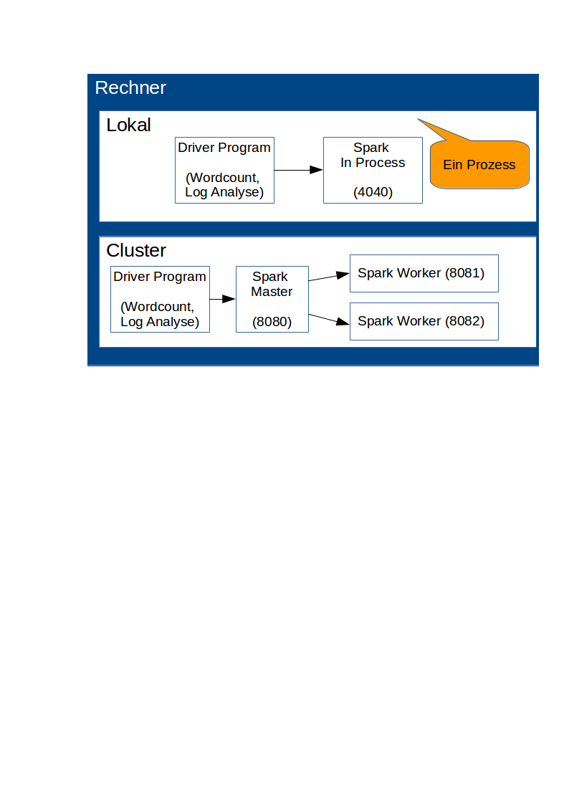

# Übung: Verteile Berechnung mit Apache Spark
Apache Spark ist ein Framework, um Berechnungen in einem Cluster zu verteilen.
Somit erlaubt Apache Spark große Datenmengen zu verarbeiten, wozu ein Rechner üblicherweise nicht in der Lage ist.

## Vorbereitung
* Erstellen sie ein Verzeichnis für die Übung (auf ihrem Home-Laufwerk oder lokal auf dem Rechner) 
und laden sie die Vorlage zur Übung von github in dieses Verzeichnis herunter 
(über `git clone` oder Download des Repositories als ZIP).
* Öffnen sie das Verzeichnis dann als Projekt innerhalb von Netbeans.
* Führen Sie das *Maven Goal* `clean package` aus.
* Öffnen sie die Website von Apache Spark (http://spark.apache.org/) für Recherchezwecke.
* Laden sie sich das vorkonfigurierte Apache Spark herunter 
(https://www.dropbox.com/s/0063mzb2jg3pfdh/spark-1.6.1-bin-hadoop2.6.zip?dl=0) und entpacken sie in dem Verzeichnis, 
in dem auch das *vorlage* Verzeichnis zu finden ist.

## Ziel
Wir führen verschiedene Berechnungen und Analysen mit Apache Spark durch:

1. Word Count: Wir zählen die Auftreten einzelner Wörter
2. Log-Analyse: Wir parsen ein Apache Solr Log, zählen die Queries und summieren die Laufzeiten

Diese Berechnungen führen wir zunächst *lokal* und anschließend in einem Cluster aus.
Um Apache Spark lokal zu starten, muss der Spark Master auf **local** gesetzt werden.
```
  SparkConf conf = new SparkConf()
      .setAppName("Cloud Computing")
      .setMaster("local");
```

Um die Berechnung in einem Spark-Cluster auszuführen reicht es die Spark Configuration etwas anzupassen:
```
  SparkConf conf = new SparkConf()
      .setAppName("Cloud Computing")
      .setMaster("spark://{IP}:7077");
```



### Wichtige Adressen
* Spark-Master: spark://{IP}:7077
* Spark-Worker-1: http://{IP}:8081/
* Spark-Worker-2: http://{IP}:8082/
* SparkUI: http://{IP}:4040/
* Spark im "in Process Mode": z.B.: local[4]

## Aufgaben
1) Testen ob Apache Spark lokal funktioniert.

* Öffnen sie im Editor die Klasse *SparkInProcessTester.java* und führen sie diese aus. Dies ist ein kleiner Test.
* Wenn der Test erfolgreich duchgelaufen ist (keine Fehler) haben sie bereits Apache Spark ausgeführt. 

2) Word Count mit Apache Spark und Java 8

* Öffen sie im Editor die Klassen *SparkWordCount.java* und *JavaWordCount.java* und implementieren sie alle Code-Abschnitte, die mit einem `TODO` Kommentar versehen sind.
* Während der Entwicklung sollten sie die Anwendung lokal ausführen (Debug, usw. möglich)
* Führen *SparkWordCount.java* und anschließend *JavaWordCount.java* lokal aus. Schauen sie auf die Ausführungszeiten in der Ausgabe? Was sehen Sie? Woran liegt das?
* Schauen sie sich auch die Job-Informationen unter http://localhost:4040 an. Was sehen sie?

3) Log-Analyse mit Apache Spark

* Öffen sie im Editor die Klassen *SparkAnalyzeLog.java* und implementieren sie alle Code-Abschnitte, die mit einem `TODO` Kommentar versehen sind.
* Während der Entwicklung sollten sie die Anwendung lokal ausführen (Debug, usw. möglich)
* Führen Sie die fertige Anwendung aus. Wie viele Requests sind im Log? Wie lange benötigen diese?
* Schauen sie sich auch die Job-Informationen unter http://localhost:4040 an. Was sehen sie?

4) Word Count und Log-Analyse im Spark Cluster ausführen

* Stellen sie sicher, dass die Spark heruntergeladen haben und das Verzeichnis stimmt.
* In der Vorlage finden sie zwei Scripte *startSparkStandalone.sh* und stopAllsparkProcesses.sh*. Mit diesen können sie das Cluster starten und wieder beenden.
* Im Script *startSparkStandalone.sh* muss die Spark-Master URL beim starten der Spark-Worker (Slaves) angepasst werden.
* Starten sie anschließend das Cluster. Der Master ist unter der URL http://localhost:8080/ erreichbar.
* Prüfen sie in der UI ob alle Worker (2) ebenfalls gestartet sind.
* Modifizieren sie die Spark-Master URLs in den Anwendungen, indem sie die Master-URL spark://{IP}:7077 setzen.
* Starten sie die Anwendungen. Untersuchen sie die Abarbeitung mittles der Webseiten.
* Schauen sie sich auch die Job-Informationen unter http://localhost:4040 an. Was sehen sie?
